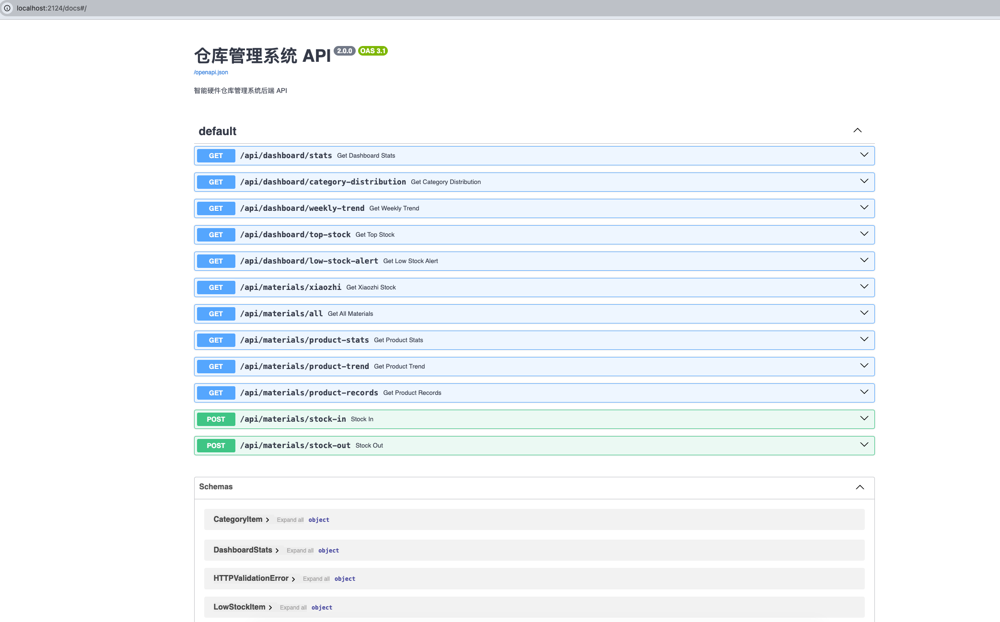
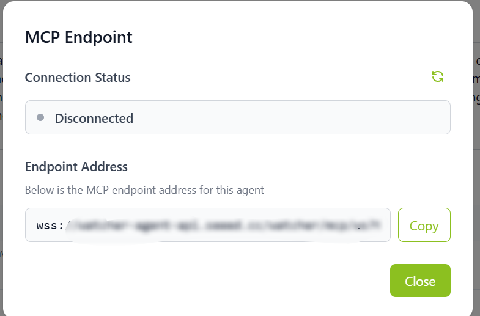
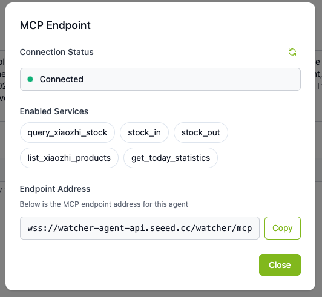
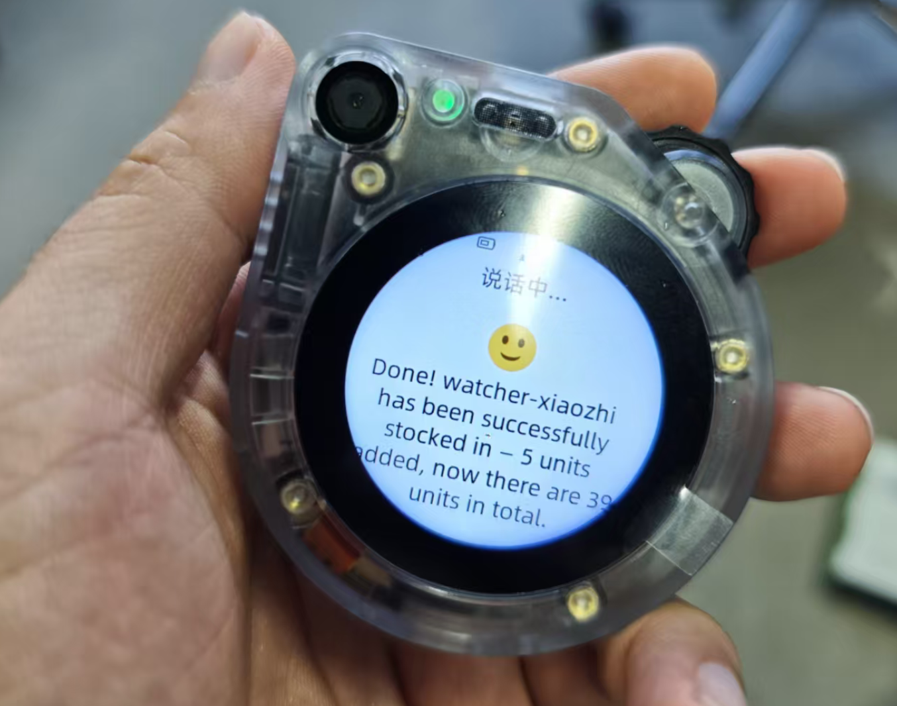

# MCP Integration with External Systems

## Overview

This guide demonstrates how to integrate your existing business systems with **SenseCAP Watcher** through **MCP (Model Context Protocol)**. Unlike the basic calculator example, this tutorial focuses on a industiral use case: **voice-controlled warehouse management**.

By the end of this tutorial, you will be able to:
- Understand the MCP architecture for enterprise system integration
- Wrap your existing REST APIs as MCP tools
- Enable voice commands like *"Query the stock of Xiaozhi Standard Version"* or *"Stock in 5 units of Watcher Xiaozhi"*

### Use Case: Voice-Controlled Warehouse Management

Imagine a warehouse operator who needs to check inventory or record stock movements while their hands are busy. With MCP integration, they can simply speak to the Watcher device:

- **"How many Xiaozhi Standard Version do we have in stock?"**
- **"Stock in 5 units of Watcher Xiaozhi Standard Version"**
- **"What's today's inventory summary?"**

The Watcher processes the voice command, calls the appropriate MCP tool, which then queries or updates your warehouse management system.

### Architecture Overview

```
┌─────────────────┐     ┌──────────────────┐     ┌─────────────────┐     ┌─────────────────┐
│                 │     │                  │     │                 │     │                 │
│  Watcher Device │────▶│   MCP Endpoint   │────▶│   MCP Server    │────▶│  Backend API    │
│  (Voice Input)  │     │  (Cloud Bridge)  │     │  (Your Code)    │     │  (Your System)  │
│                 │     │                  │     │                 │     │                 │
└─────────────────┘     └──────────────────┘     └─────────────────┘     └─────────────────┘
                                                                                  │
                                                                                  ▼
                                                                         ┌─────────────────┐
                                                                         │                 │
                                                                         │    Database     │
                                                                         │                 │
                                                                         └─────────────────┘
```

**Key Components:**
- **Watcher Device**: Captures voice commands and sends them to the AI model
- **MCP Endpoint**: Cloud service that bridges your local MCP server with the AI model
- **MCP Server**: Your Python code that wraps business logic as callable tools
- **Backend API**: Your existing REST API (FastAPI, Flask, etc.)
- **Database**: Your business data storage

## Prerequisites

### Hardware
- SenseCAP Watcher device (configured with Xiaozhi AI)
- A computer (Windows/macOS/Linux) to run the backend system and MCP server

### Software
- Python 3.10 or higher
- [uv](https://docs.astral.sh/uv/) package manager (recommended) or pip
- Git

### Account
- SenseCraft AI Platform account with MCP Endpoint access
- Refer to [MCP Endpoint Guide](/mcp_endpoint) to obtain your MCP Endpoint address

### Deployment Note

The MCP server can run on the same machine as your backend system, or on a different machine. Simply configure the API endpoint URL in `mcp/warehouse_mcp.py`:

```python
# Backend API address - change this to your actual backend URL
API_BASE_URL = "http://localhost:2124/api"  # Same machine
# API_BASE_URL = "http://192.168.1.100:2124/api"  # Different machine
```

## Part 1: Set Up the Demo Warehouse System

We provide a complete demo warehouse management system that you can use as a reference. This includes:
- A FastAPI backend with REST APIs
- A web-based dashboard
- Pre-populated sample data (Watcher Xiaozhi products)

### Step 1: Clone the Repository

```bash
git clone https://github.com/suharvest/warehouse_system.git
cd warehouse_system
```

### Step 2: Install Dependencies

Using uv (recommended):
```bash
# Install uv if you haven't
curl -LsSf https://astral.sh/uv/install.sh | sh

# Install project dependencies
uv sync
```

Or using pip:
```bash
pip install fastapi uvicorn requests pydantic fastmcp websockets
```

### Step 3: Start the Backend Service

```bash
uv run python run_backend.py
```

You should see:
```
INFO:     Uvicorn running on http://0.0.0.0:2124
INFO:     Database initialized with sample data
```

### Step 4: Verify the API

Open a new terminal and test the API:

```bash
curl http://localhost:2124/api/materials/xiaozhi
```

Expected response:
```json
[
  {
    "id": 1,
    "name": "watcher-xiaozhi(标准版)",
    "sku": "WX-STD-001",
    "category": "mainboard",
    "quantity": 150,
    "unit": "个",
    "safe_stock": 50,
    "location": "A-01-01"
  },
  ...
]
```

You can also explore the interactive API documentation at: http://localhost:2124/docs

<div style={{textAlign:'center'}}></div>

## Part 2: Wrapping APIs as MCP Tools

The demo system already has REST APIs for warehouse operations. Now let's wrap them as MCP tools for voice control.

:::tip
After runing the beackend server, you can explore all available APIs through the interactive documentation at http://localhost:2124/docs (Swagger UI). The complete MCP server code is at `mcp/warehouse_mcp.py` in the repository.
:::

### Core Concept: API to MCP Tool

The pattern is straightforward:
1. **Create an MCP server** with `FastMCP`
2. **Define tool functions** with `@mcp.tool()` decorator
3. **Call your existing APIs** inside the tool functions
4. **Return structured results** for the AI to interpret

### Key Code Walkthrough

#### 1. Initialize MCP Server

```python
from fastmcp import FastMCP
import requests

mcp = FastMCP("Warehouse System")  # Server name shown in MCP Endpoint
API_BASE_URL = "http://localhost:2124/api"  # Your backend URL
```

#### 2. Define a Tool with `@mcp.tool()`

```python
@mcp.tool()
def query_xiaozhi_stock(product_name: str = "watcher-xiaozhi(标准版)") -> dict:
    """
    Query stock information for watcher-xiaozhi products.
    Use this tool when user asks about inventory levels or stock quantity.

    Args:
        product_name: Product name to query (e.g., "watcher-xiaozhi(标准版)")
    """
    # Call your existing API
    response = requests.get(f"{API_BASE_URL}/materials/product-stats",
                           params={"name": product_name})
    data = response.json()

    # Return structured result
    return {
        "success": True,
        "quantity": data["current_stock"],
        "message": f"{data['name']} has {data['current_stock']} {data['unit']} in stock"
    }
```

**Key Points:**
- **Function name** (`query_xiaozhi_stock`) → Tool name the AI sees
- **Docstring** → Guides AI on when to use this tool
- **Parameters** → What the AI needs to extract from voice command
- **Return value** → What the AI reads back to the user

#### 3. Start the Server

```python
if __name__ == "__main__":
    mcp.run(transport="stdio")
```

### Tools in This Demo

The `warehouse_mcp.py` defines 5 tools:

| Tool Name | Voice Trigger Example | API Called |
|-----------|----------------------|------------|
| `query_xiaozhi_stock` | "Check stock of Xiaozhi Standard" | GET `/materials/product-stats` |
| `stock_in` | "Stock in 5 units of Xiaozhi" | POST `/materials/stock-in` |
| `stock_out` | "Stock out 3 Xiaozhi for sales" | POST `/materials/stock-out` |
| `list_xiaozhi_products` | "List all Xiaozhi products" | GET `/materials/xiaozhi` |
| `get_today_statistics` | "Today's inventory summary" | GET `/dashboard/stats` |

### Start the Server

```python
if __name__ == "__main__":
    mcp.run(transport="stdio")
```

## Part 3: Connect to MCP Endpoint

### Step 1: Get Your MCP Endpoint

1. Log in to [SenseCraft AI Platform](https://sensecraft.seeed.cc/ai/home)
2. Click **Watcher Agent** in the upper-right corner
3. Open **Agent Configuration** → **MCP Setting**
4. Click **Get MCP Endpoint** to obtain your unique endpoint address

<div style={{textAlign:'center'}}></div>

:::warning
Keep your MCP Endpoint address private. Do not share it publicly.
:::

### Step 2: Configure Environment Variable

**For Linux/macOS:**
```bash
export MCP_ENDPOINT="wss://your-endpoint-address"
```

**For Windows (PowerShell):**
```powershell
$env:MCP_ENDPOINT="wss://your-endpoint-address"
```

**For Windows (CMD):**
```cmd
set MCP_ENDPOINT=wss://your-endpoint-address
```

### Step 3: Start the MCP Server

Navigate to the mcp directory and run the start script:

```bash
cd mcp
./start_mcp.sh
```

Expected output:
```
================================
  MCP Service Startup Script
================================

MCP Endpoint: wss://your-endpoint-address

Checking backend service...
Backend service running normally (port 2124)

Starting MCP service...

================================
  MCP Service Started Successfully!
================================

Press Ctrl+C to stop the service
```

### Step 4: Verify Connection Status

Go back to the SenseCraft AI Platform and check the MCP connection status. You should see:
- **Connection Status**: Connected
- **Enabled Services**: Warehouse System

<div style={{textAlign:'center'}}></div>

## Part 4: Test Voice Commands

Now you can test the integration using your Watcher device!

### Example Voice Commands

| Voice Command | Expected Action |
|---------------|-----------------|
| "Query the stock of Xiaozhi Standard Version" | Calls `query_xiaozhi_stock` tool |
| "How many Xiaozhi Professional Version do we have?" | Calls `query_xiaozhi_stock` with professional version |
| "Stock in 5 units of Watcher Xiaozhi Standard Version" | Calls `stock_in` tool with quantity=5 |
| "Stock out 3 Xiaozhi units for sales" | Calls `stock_out` tool with quantity=3 |
| "What's today's inventory summary?" | Calls `get_today_statistics` tool |
| "List all Xiaozhi products" | Calls `list_xiaozhi_products` tool |

### Expected Responses

**Query Stock:**
> "The stock query was successful. Watcher Xiaozhi Standard Version currently has 150 units in stock at location A-01-01. Stock status is normal."

**Stock In:**
> "Successfully added 5 units of Watcher Xiaozhi Standard Version. Previous quantity was 150, new quantity is 155."

<div style={{textAlign:'center'}}></div>

## Best Practices

### 1. Tool and Parameter Naming

Tool names and parameters should be clear and descriptive so the AI model understands their purpose:

```python
# Good - Clear and descriptive
@mcp.tool()
def query_xiaozhi_stock(product_name: str) -> dict:
    ...

# Bad - Unclear abbreviations
@mcp.tool()
def qry_stk(pn: str) -> dict:
    ...
```

### 2. Comprehensive Docstrings

The docstring guides the AI model on when and how to use the tool:

```python
@mcp.tool()
def stock_in(product_name: str, quantity: int) -> dict:
    """
    Record stock intake for watcher-xiaozhi products.
    Use this tool when the user wants to add inventory.

    Args:
        product_name: The exact product name (e.g., "watcher-xiaozhi(标准版)")
        quantity: Number of units to add (must be positive integer)

    Returns:
        Success status and updated inventory information
    """
```

### 3. Use Logger Instead of Print

Since MCP uses stdio for communication, never use `print()` for debugging:

```python
# Good - Use logger
logger.info(f"Processing stock in: {product_name}")

# Bad - Will break MCP communication
print(f"Processing stock in: {product_name}")
```

### 4. Return Value Limits

Keep return values concise (typically under 1024 bytes):

```python
# Good - Concise response
return {
    "success": True,
    "quantity": 150,
    "message": "Stock query successful"
}

# Bad - Too verbose
return {
    "success": True,
    "full_product_details": {...},  # Avoid large nested objects
    "complete_history": [...]  # Avoid long arrays
}
```

### 5. Error Handling

Always handle errors gracefully and return meaningful messages:

```python
try:
    result = api_post("/materials/stock-in", data)
    return result
except Exception as e:
    logger.error(f"Stock in failed: {str(e)}")
    return {
        "success": False,
        "error": str(e),
        "message": "Failed to record stock intake. Please try again."
    }
```

## Troubleshooting

### Backend Service Not Running

**Symptom:** MCP tools return "Cannot connect to backend service"

**Solution:**
1. Ensure the backend is running: `uv run python run_backend.py`
2. Check if port 2124 is available: `curl http://localhost:2124/api/dashboard/stats`

### MCP Connection Timeout

**Symptom:** "Connecting to WebSocket server..." hangs indefinitely

**Solution:**
1. Verify your MCP_ENDPOINT is correct
2. Check your network connection
3. Ensure the endpoint URL starts with `wss://`

### Tool Not Recognized

**Symptom:** Voice command doesn't trigger the expected tool

**Solution:**
1. Check tool naming - use clear, descriptive names
2. Verify docstring describes when to use the tool
3. Restart the MCP server after code changes

### Connection Limit Exceeded

**Symptom:** "Maximum connections reached" error

**Solution:**
1. Close other MCP connections
2. Wait a few minutes and retry
3. Each endpoint has a connection limit

## Adapting for Your Own System

To integrate your own business system:

1. **Identify Key Operations**: What actions do users need via voice?
2. **Document Your APIs**: Ensure your backend has REST endpoints for these operations
3. **Create MCP Tools**: Wrap each API endpoint as an `@mcp.tool()` function
4. **Write Clear Docstrings**: Help the AI understand when to use each tool
5. **Test Thoroughly**: Verify voice commands trigger the correct tools

### Example: Adapting for a Different System

If you have an order management system:

```python
@mcp.tool()
def check_order_status(order_id: str) -> dict:
    """
    Check the status of a customer order.
    Use this when the user asks about order tracking or delivery status.

    Args:
        order_id: The unique order identifier (e.g., "ORD-2024-001")

    Returns:
        Order status, estimated delivery date, and tracking information
    """
    return api_get(f"/orders/{order_id}/status")
```

## Technical Support

<div class="button_tech_support_container">
<a href="https://discord.com/invite/QqMgVwHT3X" class="button_tech_support_sensecap"></a>
<a href="https://support.sensecapmx.com/portal/en/home" class="button_tech_support_sensecap3"></a>
</div>

<div class="button_tech_support_container">
<a href="mailto:support@sensecapmx.com" class="button_tech_support_sensecap2"></a>
<a href="https://github.com/Seeed-Studio/wiki-documents/discussions/69" class="button_discussion"></a>
</div>
