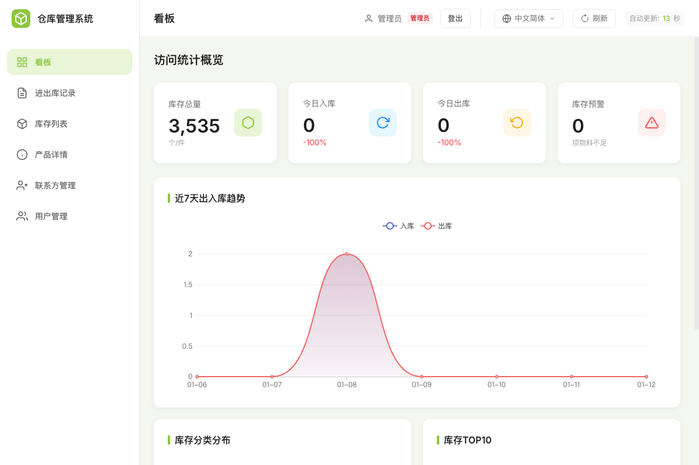
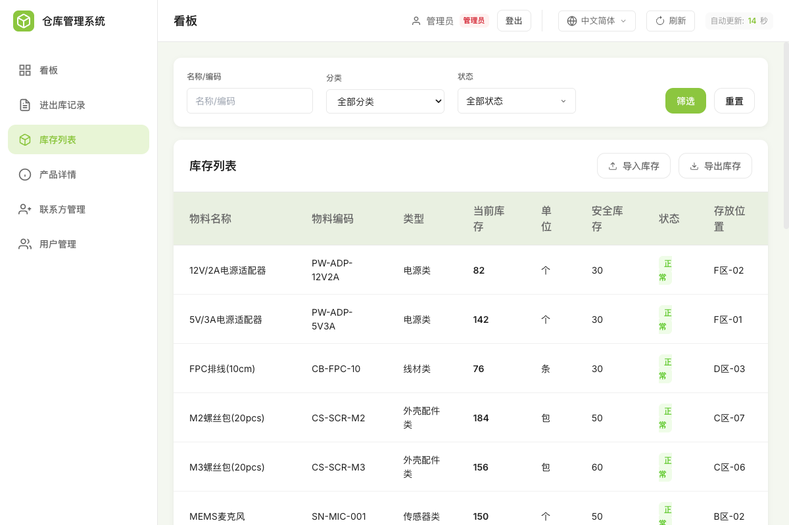
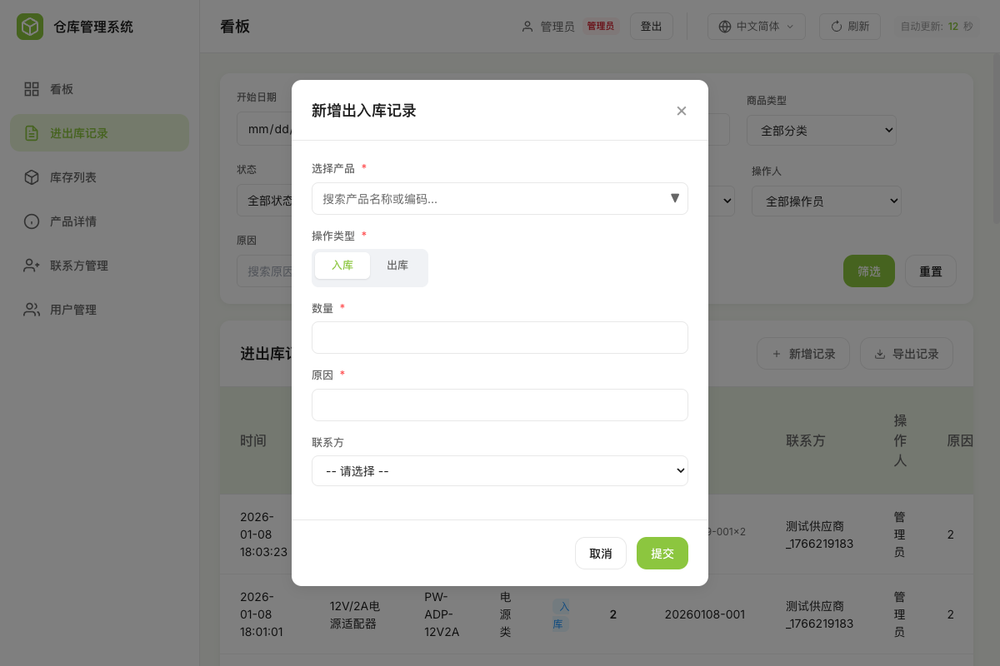
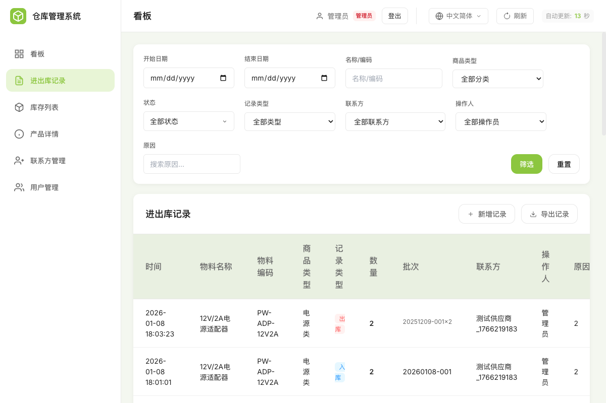
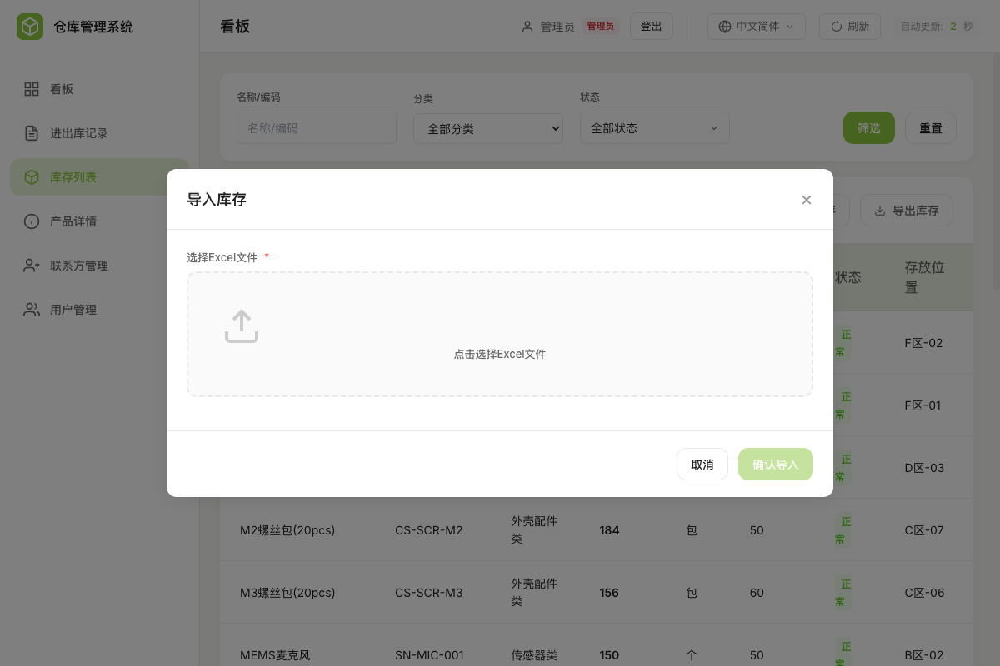

# 仓库管理系统介绍

## 这是什么？

这是一套简单易用的**仓库库存管理系统**，帮助您：
- 随时掌握库存数量
- 记录每一笔进出库
- 追溯历史操作
- 替代繁琐的 Excel 表格管理
- **支持语音操作**，解放双手

---

## 需要的硬件设备

本系统内置在专用硬件设备中，开箱即用。

**根据您的场景选择：**

| 您的需求 | 推荐设备 |
|---------|---------|
| 办公室有显示器，只需要主机 | [reComputer R1000](https://cn.seeedstudio.com/product/recomputer-r1000-series-raspberry-pi-iot-gateway-controller-cm4-powered-ai-capable)（无屏幕版） |
| 仓库现场使用，需要触摸屏一体机 | [reTerminal DM](https://cn.seeedstudio.com/product/reterminal-dm-10-1-industrial-hmi-cm4108032-raspberry-pi-industrial-panel-pc-panel-controller)（10寸触摸屏） |
| 需要语音入库/出库（解放双手） | 加装 [SenseCAP Watcher](https://cn.seeedstudio.com/product/sensecap-watcher-the-physical-ai-agent-for-smarter-spaces) |

<table>
<tr>
<td width="33%" align="center">
 
<b>reComputer R1000</b> 
无屏幕版
</td>
<td width="33%" align="center">
 
<b>reTerminal DM</b> 
带触摸屏
</td>
<td width="33%" align="center">
 
<b>SenseCAP Watcher</b> 
语音交互
</td>
</tr>
</table>

---

## 主要功能

### 1. 看板首页 —— 一眼看清库存状况

打开系统，首先看到的就是"看板"页面，这里展示了最重要的数据：

**您可以看到：**
- **库存总量**：仓库里现在一共有多少东西
- **今日入库/出库**：今天进了多少、出了多少
- **库存预警**：有多少产品库存偏低，需要关注
- **7天趋势图**：最近一周的进出情况变化

---

### 2. 库存列表 —— 查看所有产品

点击左侧菜单的"库存列表"，可以看到仓库里所有产品的详细信息：

**每个产品显示：**
- **物料名称**：产品叫什么
- **物料编码**：产品的唯一编号（方便查找）
- **类型**：属于哪一类（如电源类、线材类等）
- **当前库存**：现在有多少
- **单位**：按什么单位计算（个、包、条等）
- **安全库存**：低于这个数量就要补货了
- **状态**：正常（绿色）、偏低（黄色）、告急（红色）
- **存放位置**：放在仓库的哪个位置

**筛选功能**：可以按名称搜索，或按类型、状态筛选，快速找到需要的产品。

---

### 3. 进出库操作 —— 记录每一笔进出

当货物入库或出库时，点击"新增记录"按钮，填写相关信息：

**需要填写：**
- **选择产品**：从下拉列表选择是哪个产品
- **操作类型**：入库还是出库
- **数量**：这次进/出多少
- **原因**：为什么入库或出库（如：采购入库、销售出库、退货等）
- **联系方**：相关的供应商或客户（可选）

点击"提交"，系统会自动更新库存数量，并保存这条记录。

---

### 4. 进出库记录 —— 追溯每一笔操作

所有的进出库记录都可以在"进出库记录"页面查看：

**可以看到：**
- 什么时间
- 什么产品
- 入库还是出库
- 数量多少
- 谁操作的
- 操作原因
- 相关的供应商/客户

**筛选功能**：可以按日期范围、产品名称、操作类型等条件筛选，快速找到需要的记录。

---

### 5. 联系方管理 —— 管理供应商和客户

在"联系方管理"页面，可以添加和管理供应商、客户的信息：

**可以记录：**
- 名称
- 类型（供应商、客户、或两者都是）
- 联系电话
- 邮箱
- 地址

这样在记录进出库时，可以直接选择联系方，方便后续追溯。

---

### 6. 用户管理 —— 不同人员不同权限

管理员可以在"用户管理"页面添加系统用户：

**三种权限：**
| 权限 | 可以做什么 |
|------|-----------|
| 管理员 | 所有功能，包括管理用户 |
| 操作员 | 查看数据、进出库操作、导入导出 |
| 访客 | 只能查看，不能操作 |

---

## 与 Excel 无缝对接

### 从 Excel 导入数据

如果您之前用 Excel 管理库存，可以直接导入！

**导入步骤：**
1. 点击"导入库存"按钮
2. 选择您的 Excel 文件
3. 系统会自动读取数据并显示预览
4. 确认后完成导入

**Excel 格式要求：**

请将您的库存表格整理成以下格式（第一行为表头）：

| 物料名称 | 物料编码(SKU) | 类型 | 当前库存 | 单位 | 安全库存 | 存放位置 |
|---------|--------------|------|---------|------|---------|---------|
| 12V/2A电源适配器 | PW-ADP-12V2A | 电源类 | 82 | 个 | 30 | F区-02 |
| 5V/3A电源适配器 | PW-ADP-5V3A | 电源类 | 45 | 个 | 30 | F区-01 |
| FPC排线(10cm) | CB-FPC-10 | 线材类 | 76 | 条 | 30 | D区-03 |
| M2螺丝包(20pcs) | CS-SCR-M2 | 外壳配件类 | 184 | 包 | 50 | C区-07 |
| MEMS麦克风 | SN-MIC-001 | 传感器类 | 150 | 个 | 50 | B区-02 |
| watcher-xiaozhi(专业版) | FG-WZ-PRO | 成品 | 39 | 台 | 10 | H区-03 |

**必填列：**
- 物料名称
- 物料编码(SKU) —— 每个产品的唯一编号，不能重复
- 当前库存

**选填列：**
- 类型、单位、安全库存、存放位置（不填会使用默认值）

### 导出为 Excel

需要打印或分享时，可以随时导出：
- **导出库存清单**：当前所有产品的库存情况
- **导出进出库记录**：历史操作记录

导出的文件可以用 Excel 打开，方便打印或进一步处理。

---

## 语音交互功能

配合 **SenseCAP Watcher** 语音设备，可以用说话的方式操作系统：

**支持的语音指令：**
- "查询小智标准版的库存" → 系统告诉您当前库存数量
- "入库5个小智设备" → 自动记录入库
- "出库3个给销售" → 自动记录出库
- "今天的库存情况" → 播报今日统计

**适用场景：**
- 仓库现场操作，双手搬货不方便时
- 快速查询，无需打开电脑
- 多人同时操作，提高效率

---

## 快速上手

1. **开机**：接通电源，设备自动启动
2. **登录账号**：输入管理员分配的用户名和密码
3. **查看看板**：了解当前库存状况
4. **记录进出**：货物进出时，点击"新增记录"填写信息
5. **定期检查**：关注库存预警，及时补货

---

## 常见问题

**Q: 忘记密码怎么办？**
A: 联系管理员重置密码。

**Q: 可以多人同时使用吗？**
A: 可以，每个人用自己的账号登录即可。

**Q: 数据会丢失吗？**
A: 所有数据都保存在设备里，断电也不会丢失。建议定期导出备份。

**Q: 手机上能用吗？**
A: 可以，同一网络下用手机浏览器访问设备地址即可。

**Q: 语音设备怎么连接？**
A: Watcher 通过网络与系统连接，首次使用需要简单配置。详情请咨询技术支持。

---

如有其他问题，请联系系统管理员或技术支持。
